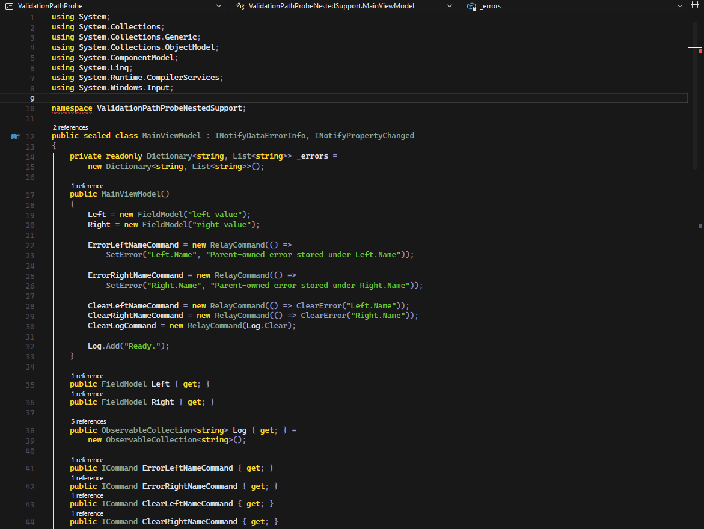
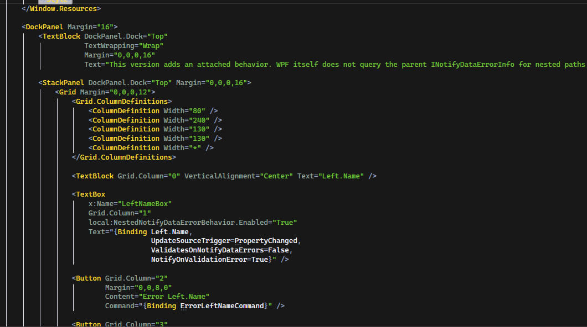

  

  # Gruber Darker for Visual Studio

  A native Visual Studio dark theme with muted UI chrome and a warm, readable syntax palette —
  ported from the Gruber Darker lineage that runs through Emacs and BBEdit.

  
  
  
  

  > **Note:** shields.io retired the `visual-studio-marketplace` version/install/rating badges
  > in April 2026 (no public Marketplace API for third parties), so they're omitted here. The
  > badge above just links to the listing — swap its href once the extension is published.

## Screenshots

  
   
  

## About

**Gruber Darker for Visual Studio** brings a long-running color scheme lineage natively into
the VS shell — editor, tool windows, and chrome alike — rather than just recoloring the text
editor.

The lineage:

1. [**Gruber Dark**](https://daringfireball.net/projects/bbcolors/) — the original BBEdit
   colour scheme by John Gruber.
2. [**Gruber Darker**](https://github.com/rexim/gruber-darker-theme) — a darker Emacs port of
   Gruber Dark, originally by Jason Blevins and now maintained by Alexey Kutepov (rexim).
3. **This extension** — a Visual Studio port of the Gruber Darker palette, mapped across the
   full set of VS editor, language service, and environment colour tokens (not just the code
   editor).

The palette itself (`bg`, `fg`, `red`, `green`, `yellow`, `brown`, `niagara`, `wisteria`, …) is
carried over unchanged from `gruber-darker-theme.el`; what this project adds is the mapping of
those roles onto Visual Studio's much larger token surface.

## Features

- Full-shell theming: editor surface, language service classifications, tool windows, and
  environment chrome all resolve to the same Gruber Darker palette, not just syntax colours.
- Warm, low-saturation syntax highlighting: comments in brown, strings in green, keywords in
  yellow, types in a muted quartz grey.
- Consistent diagnostic colouring for errors, warnings, added/removed/changed state, and
  debugger execution markers.

## Installation

### From the Visual Studio Marketplace

1. Open **Extensions → Manage Extensions** in Visual Studio.
2. Search for **Gruber Darker**.
3. Select **Download**, then restart Visual Studio to complete installation.

*(Marketplace listing pending — see the badge note above.)*

### From a `.vsix` file

1. Download the latest `.vsix` from the [Releases](../../releases) page, or build it locally
   (see [CONTRIBUTING.md](CONTRIBUTING.md)).
2. Double-click the `.vsix` file and follow the installer prompts.

## Usage

1. In Visual Studio, open **Tools → Options → Environment → General**.
2. Set **Color theme** to **Gruber Darker**.
3. Select **OK**.

## Requirements

- Visual Studio 2022 (installation target range `[17.0, 18.0)`) with the **Visual Studio core
  editor** component.
- .NET Framework 4.7.2 or later.

## Contributing

The theme is generated from a token-mapping pipeline rather than hand-written XML. See
[CONTRIBUTING.md](CONTRIBUTING.md) for the pipeline, how to regenerate the theme, and how to
build and debug the extension locally.

## License

Released under the [MIT License](LICENSE).

## Credits

- [Gruber Dark for BBEdit](https://daringfireball.net/projects/bbcolors/) — original colour
  scheme by [John Gruber](https://daringfireball.net/).
- [Gruber Darker for Emacs](https://github.com/rexim/gruber-darker-theme) — Emacs port
  originally by Jason Blevins, maintained by Alexey Kutepov (rexim).
